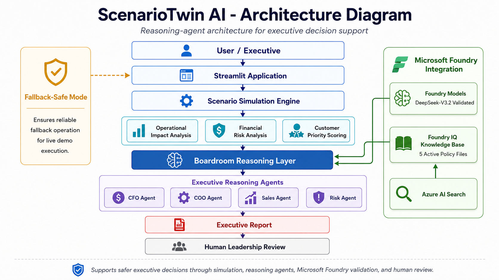
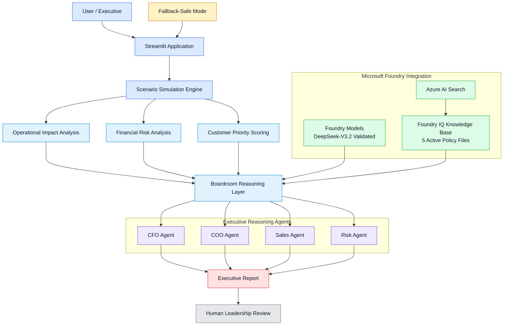

# ScenarioTwin AI

**ScenarioTwin AI** is a reasoning-agent prototype for executive decision support.

It helps business teams simulate disruption scenarios, understand operational and financial impact, prioritize customers, and generate a boardroom-ready action plan.

This project was built for the **Microsoft AI Skills Fest / Agents League Hackathon** under the **Reasoning Agents** track.

---

## Why this project exists

A demand spike is usually seen as good news.

But when inventory is limited, growth can quickly become a risk.

If a company accepts all demand without allocation rules, it may create stockouts, missed deliveries, customer dissatisfaction, lost revenue, and poor operational decisions.

ScenarioTwin AI explores this problem through a simple but realistic question:

> When demand increases and inventory is constrained, which demand should the business fulfill first?

Instead of only showing metrics, the system simulates the scenario, evaluates trade-offs, and produces an executive recommendation.

---

## Demo scenario

The main demo scenario is:

**Demand Spike + Inventory Constraint**

In this scenario:

| Metric                |             Result |
| --------------------- | -----------------: |
| Demand spike          |                40% |
| Products analyzed     |                  6 |
| Constrained products  |                  6 |
| Unfulfilled units     |              1,778 |
| Revenue at risk       |       S/ 21,691.40 |
| Profit at risk        |        S/ 9,600.40 |
| Average service level |             49.41% |
| Top priority customer | Limpieza Total SAC |

The scenario is classified as **Critical**.

The final recommendation is not to accept all demand blindly, but to activate a controlled allocation plan.

---

## What ScenarioTwin AI does

ScenarioTwin AI combines five layers:

1. **Scenario simulation**
   Models a demand spike and compares expected demand against available inventory.

2. **Operational impact analysis**
   Identifies constrained products, shortages, service level reduction, and fulfillment gaps.

3. **Customer priority reasoning**
   Ranks customers based on business value, exposed revenue, affected products, and strategic importance.

4. **Boardroom agents**
   Uses role-based agents to analyze the same scenario from different executive perspectives.

5. **Executive report**
   Produces a boardroom-ready decision summary with recommendations, risks, guardrails, and human review.

---

## Boardroom agents

The project uses four executive reasoning agents:

| Agent       | Focus                                                              |
| ----------- | ------------------------------------------------------------------ |
| CFO Agent   | Revenue at risk, profit at risk, margin protection                 |
| COO Agent   | Inventory constraints, fulfillment capacity, operational execution |
| Sales Agent | Customer priority, retention, strategic accounts                   |
| Risk Agent  | Overcommitment risk, resilience, decision guardrails               |

Each agent evaluates the same business crisis from a different point of view.

The goal is to make the decision process feel closer to a real executive discussion, not just a static dashboard.

---

## Microsoft Foundry integration

ScenarioTwin AI includes Microsoft Foundry validation as part of the solution architecture.

Current integration status:

| Component                   | Status                                           |
| --------------------------- | ------------------------------------------------ |
| Foundry project             | `scenario-twin-ai-westus`                        |
| Model                       | `DeepSeek-V3.2` validated in Foundry Models      |
| Foundry IQ / Knowledge Base | Active                                           |
| Knowledge source            | `scenario-twin-policy-files-v2`                  |
| Policy files                | 5 active files                                   |
| AI Search                   | `scenario-twin-ai-search-ncus` connected         |
| Foundry Agent runtime       | Capacity limitation encountered                  |
| Demo mode                   | Local Streamlit app with fallback-safe execution |

During development, the model was successfully tested in Microsoft Foundry Models and the Foundry IQ Knowledge Base was created and activated.

The Foundry Agent runtime experienced capacity / `too_many_requests` limitations, so the live demo uses a fallback-safe mode. This keeps the demo reliable while preserving the intended Foundry-based architecture.

---

## How the demo works

The demo flow is:

1. Select the scenario: **Demand Spike + Inventory Constraint**
2. Set the demand spike to **40%**
3. Run the simulation
4. Review the executive overview
5. Analyze product constraints
6. Identify the top priority customer
7. Review the reasoning from the boardroom agents
8. Show the Microsoft Foundry integration status
9. Generate the executive report

The final output is a recommended allocation strategy for leadership review.

---

## Final recommendation generated by the system

ScenarioTwin AI recommends:

> Do not accept all demand without allocation rules.

The recommended action plan is:

* Activate a controlled allocation plan.
* Protect strategic customers first.
* Prioritize replenishment of constrained high-impact products.
* Avoid unprofitable fulfillment promises.
* Escalate the final allocation plan to human leadership before execution.

---

## Architecture



The image below summarizes the architecture. The Mermaid diagram is included as an editable version.



---

## Tech stack

* Python
* Streamlit
* Pandas
* Microsoft Foundry
* Foundry Models
* DeepSeek-V3.2
* Foundry IQ Knowledge Base
* Azure AI Search
* Local fallback-safe reasoning mode

---

## Running locally

Clone the repository:

```bash
git clone <your-repository-url>
cd enterprise-scenario-twin
```

Install dependencies:

```bash
pip install -r requirements.txt
```

Run the app:

```bash
streamlit run app.py
```

Open the local URL shown in the terminal, usually:

```text
http://localhost:8501
```

---

## Project structure

```text
enterprise-scenario-twin/
├── app.py
├── requirements.txt
├── README.md
├── data/
├── docs/
└── assets/
```

The structure may change slightly as the project is prepared for final submission.

---

## Safety and reliability

ScenarioTwin AI is designed as a decision-support system.

It does not automatically execute business decisions.

The system includes:

* Human review before execution
* Transparent role-based reasoning
* Risk guardrails
* Fallback-safe mode
* Clear separation between recommendation and final approval

This matters because customer allocation, inventory prioritization, and revenue protection are high-impact business decisions.

---

## Demo video

Demo video link:

*To be added after recording and upload.*

---

## Author

**Jose Andres Mamani**

* Project: ScenarioTwin AI
* Event: Microsoft AI Skills Fest / Agents League Hackathon
* Track: Reasoning Agents

